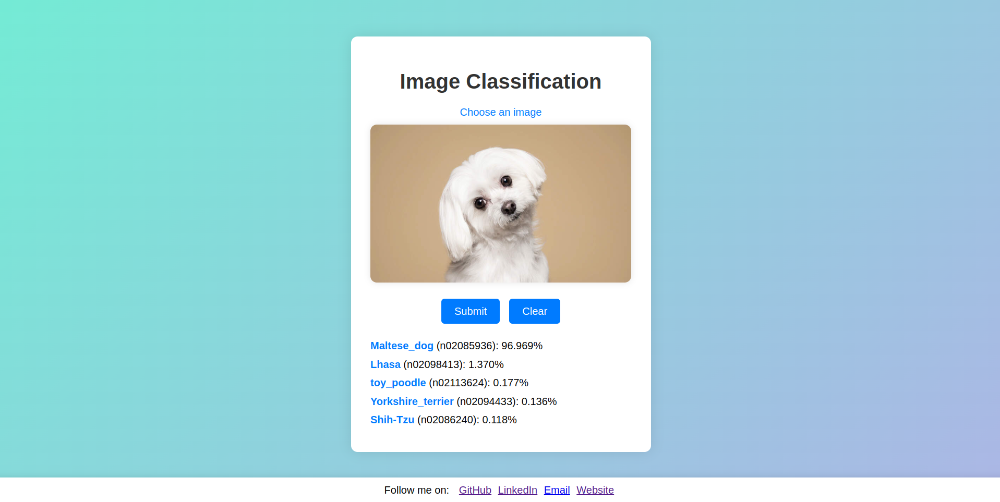

# iClassify: Containerized Flask App for Image Classification

Check out at [https://bref-madame-89020-2d391c96f102.herokuapp.com/](https://bref-madame-89020-2d391c96f102.herokuapp.com/) hosted on Heroku dyno.

This is a containerized `Flask` application for **image classification** deployed on `Heroku` dyno. Under the hood, it leverages the power of `PyTorch`, a deep learning framework, to process input images and `Docker` for containerization and `Heroku` for hosting.
Essentially, you can send an image to this web app, and it will utilize a pre-trained model `ResNet50` trained on **IMAGENET1K_V1** to classify the image and provide the **top 5** probable class from the **ImageNet** database.



**Functionality**: Image Classification  
**Model**: Pre-trained `PyTorch` model (trained on **ImageNet** dataset)  
**Output**: The **API** will analyze the uploaded image and predict the most likely classification based on the **ImageNet** classes.


## Goal
Build and deploy a **REST API** that can classify images using a pre-trained `PyTorch` model.

## Project Structure
```
.
├── app.py                  # Main Flask application file
├── requirements.txt        # Text file listing dependencies
├── Dockerfile   # Dockerfile for building the image
├── models                   # Directory for model files
├── utils                   # Directory for utility functions
└── ...                     # Other application-specific files
```

## Tech Stack:
- Programming Language: `Python`
- Deep Learning Framework: `PyTorch` *CPU*
- Web Framework: `Flask`
- Cloud Platform: `Heroku`
- Version Control System: `Git`
- API Testing Tool: `Postman`
- Containerization: `Docker`

## Deployment Method via Containerization:

[`Procfile`](/Procfile) specifies the command to run WSGI server.

1. Login to Heroku
`$ sudo heroku login`

2. Login to Heroku contianer registry
`$ sudo heroku:container login`

3. Create a heroku app
`$ heroku create`

4. List app
`$ heroku apps`

4. Push the image to heroku registry
`$ heroku container:push web -a <app-name>`

5. Create container on heroku host publicly
`$ heroku container:release web -a <app-name>`

6. Open in browser
`$ heroku open -a <app-name>`

7. Check the logs of the app
`$ heroku logs --tail -a <app-name>`


## Result:


</div><h3 align="left">Connect with me:</h3>
<div> <a href="https://www.linkedin.com/in/https://www.linkedin.com/in/amirthapamagar/" target="_blank"></a>
<a href="https://github.com/amirtmgr" target="_blank"></a>
<a href = "mailto:amir.thapamagar01@gmail.com"></a>
<a href="https://www.xing.com/profile/Amir_ThapaMagar" target="_blank"></a>

